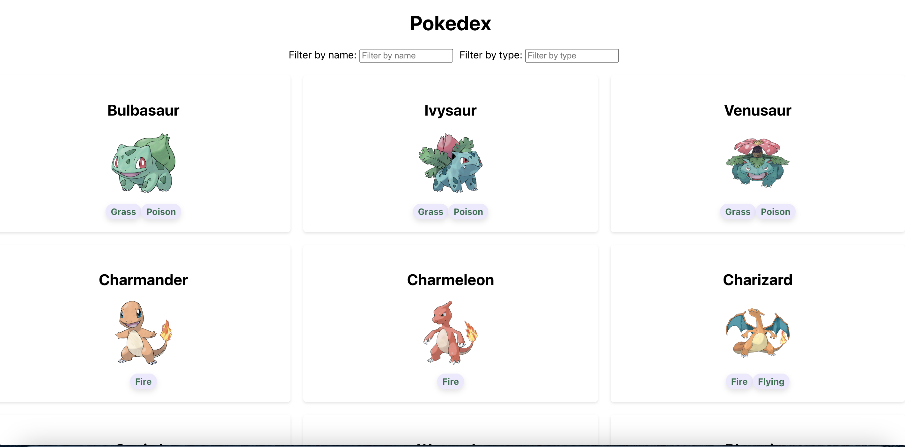

# Pokedex

## Introduction
Pokedex helps Pokemon trainers to look up detailed information on each Pokemon, including species name, type, and image.

## Top-level Directory Layout
    .
    |-- public              # Assets
        |-- images          # Images
        |-- index.html      # entry point for browser
    |-- src
        |-- components      # All components, containers, and stories used in this project.
        |-- data            # Json data for all pokemons info
        |-- styles          # CSS files for styling components
        |-- tests           # Test files
        |-- App.js          # Root component
        |-- index.js        # Index file for React component rendering
        |-- utilities.js    # Utilities
        

## Installation
To install the Pokedex application, follow these steps:
1. Clone the repository to the local machine.
2. Navigate to the project directory in the terminal.
3. Run `npm install` to install the dependencies.
4. Run `npm start` to start the development server.

## Usage
Once the application is running, you can access it by navigating to [http://localhost:3000](http://localhost:3000) in the web browser.

The web page will display a grid of all Pokemons with pagination. Trainers can also,
1. Filter pokemons by their name
2. Filter pokemons by their types

## Screenshot

## Tests
Run `npm test`
### Test Results

*Notes: node version may cause error while running the test suites, in order to run tests, you can update your node version up to v19.8.1*

## Storybook
Run `npm run storybook`, you can access it by navigating to [http://localhost:6006](http://localhost:6006) in the web browser 